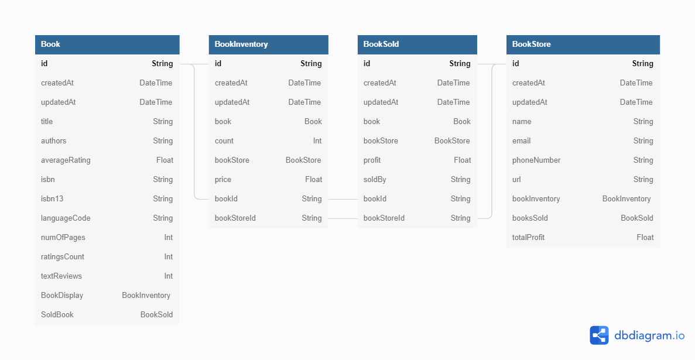
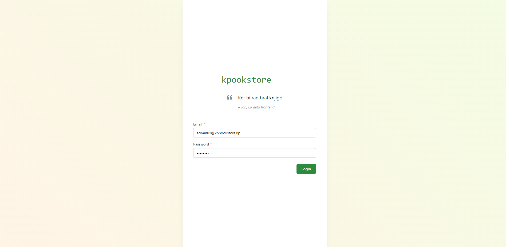
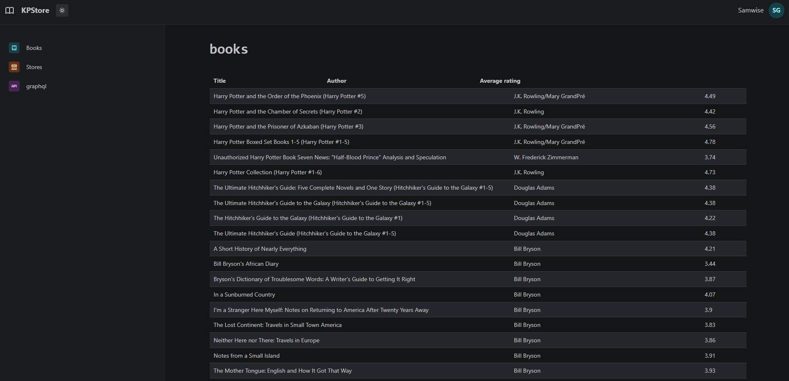
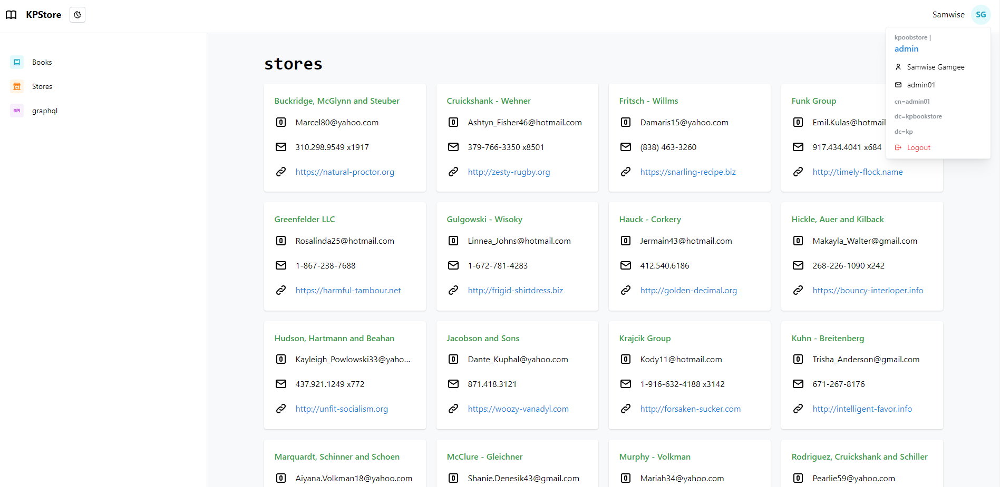
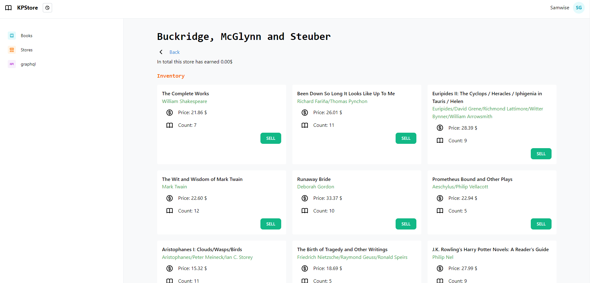
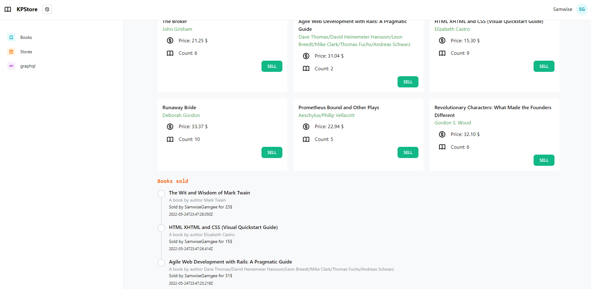
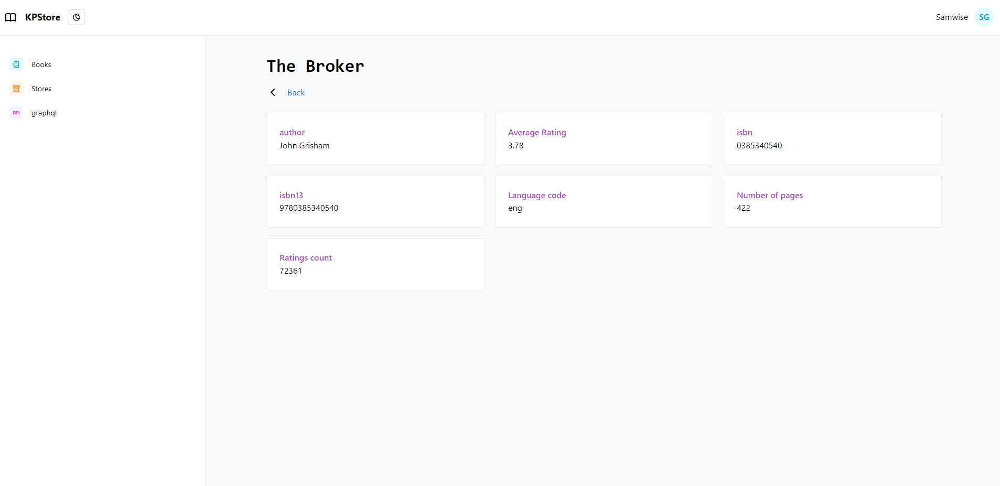

# Documentation

## Introduction

This was a dummy platform I built for the **Komunikacijski protokoli** course. It was hosted on [https://kpbookstore.ddns.net/login](https://kpbookstore.ddns.net/login). The following criteria was imposed:

- program a REST app
- endpoints should support `content negotiation` with 3 formats
- optional: LDAP authentication and resource protection
- REST operations should be safe
- optional: use a database to persist the data
- use HTTP1.1 and HTTP/2
- optional: use HTTP/3
- implement GraphQL

I added some additional features such as

- a frontend made in react
- sessions and cookie auth
- TLS and reverse proxy
- database seeding

The platform itself mimics a book selling platform, where the users (LDAP users) can sell books in stores. The store hold some profit and receipts are automatically stored.

## Disclaimer

This stack is in no way production ready or secure. Just a homework assignment with lots of different concepts and challenges. It was also made in 2 days, so yeah.

## Stack

Stack consists of the following components. All of the reside on the `prod-network` docker network but expose some ports, which aren't necessarily visible through the firewall.

- PostgreSQL database
  - Exposed ports
    - 5432:5432
- NestJS API backend server
  - Serves REST endpoints
    - Almost all of them are protected
  - Uses Prisma for the ORM
  - Data can be seeded from a csv and some randomly generated stores and inventory can be added
  - Support the following content negotiation formats
    - `application/json`
    - `text/csv`
    - `text/xml`
    - `text/yaml`
  - Exposes OpenAPI Swagger documentation on `/api/docs`
  - Exposes GraphQL on `/graphql`
    - Supports most of the queries that are expected for object type
    - Has one example subscription
  - Authenticates with OpenLDAP
    - uses passport library to do so: using the mail as the primary key
- Caddy HTTPS server
  - Also hosts static files made with react
  - Exposed ports
    - 80:80
    - 443:443
    - 443:443/udp
- OpenLDAP server
  - Exposed ports
    - 389:389
    - 636:636
  - Uses a bootstrap file to create the initial users

## Database schema



## LDAP Data Interchange Format

> Bootstrap file

Adds one Organization unit called `Groups`

Adds 3 groups:

- Sellers
- Clerks
- Admins

Adds 6 users:

- 2 Sellers
- 2 Clerks
- 2 Admins

Passwords are `SSHA` encrypted but are all `12345678`

```ldif
# Group OU
dn: ou=Groups,dc=kpbookstore,dc=kp
changetype: add
objectclass: organizationalUnit
ou: Groups

# Users
dn: cn=seller01,dc=kpbookstore,dc=kp
changetype: add
objectclass: inetOrgPerson
cn: seller01
givenname: seller01
displayname: Frodo 
sn: Baggins
mail: seller01@kpbookstore.kp
userpassword: 12345678

dn: cn=seller02,dc=kpbookstore,dc=kp
changetype: add
objectclass: inetOrgPerson
cn: seller02
givenname: seller02
displayname: Aragorn 
sn: Ranger of the North
mail: seller02@kpbookstore.kp
userpassword: {SSHA}8zqIiFMZJlq3Z8VCFcv+uStj5WqMpzjW

# Clerks 
dn: cn=clerk01,dc=kpbookstore,dc=kp
changetype: add
objectclass: inetOrgPerson
cn: clerk01
givenname: clerk01
displayname: Jan 
sn: Vasiljevic
mail: clerk01@kpbookstore.kp
userpassword: {SSHA}8zqIiFMZJlq3Z8VCFcv+uStj5WqMpzjW

dn: cn=clerk02,dc=kpbookstore,dc=kp
changetype: add
objectclass: inetOrgPerson
cn: clerk02
givenname: clerk02
displayname: Lan
sn: Vukusic
mail: clerk02@kpbookstore.kp
userpassword: {SSHA}8zqIiFMZJlq3Z8VCFcv+uStj5WqMpzjW

# Admins
dn: cn=admin01,dc=kpbookstore,dc=kp
changetype: add
objectclass: inetOrgPerson
cn: admin01
givenname: admin01
displayname: Samwise
sn: Gamgee
mail: admin01@kpbookstore.kp
userpassword: {SSHA}8zqIiFMZJlq3Z8VCFcv+uStj5WqMpzjW

dn: cn=admin02,dc=kpbookstore,dc=kp
changetype: add
objectclass: inetOrgPerson
cn: admin02
givenname: admin02
displayname: Merry
sn: Brandybuck
mail: admin02@kpbookstore.kp
userpassword: {SSHA}8zqIiFMZJlq3Z8VCFcv+uStj5WqMpzjW


# Group mappers
dn: cn=Sellers,ou=Groups,dc=kpbookstore,dc=kp
changetype: add
cn: Sellers
objectclass: groupOfUniqueNames
# Users that are Sellers
uniqueMember: cn=seller01,dc=kpbookstore,dc=kp
uniqueMember: cn=seller02,dc=kpbookstore,dc=kp

dn: cn=Clerks,ou=Groups,dc=kpbookstore,dc=kp
changetype: add
cn: Clerks
objectclass: groupOfUniqueNames
# Users that are Clerks
uniqueMember: cn=clerk01,dc=kpbookstore,dc=kp
uniqueMember: cn=clerk02,dc=kpbookstore,dc=kp

dn: cn=Admins,ou=Groups,dc=kpbookstore,dc=kp
changetype: add
cn: Admins
objectclass: groupOfUniqueNames
# Users that are Admins
uniqueMember: cn=admin01,dc=kpbookstore,dc=kp
uniqueMember: cn=admin02,dc=kpbookstore,dc=kp
```

## Reverse proxy

The following config was used to establish a secure and http/3 compliant connection between the browser and server.

```nginx
{
  servers :443 {
    protocol {
      experimental_http3
    }
  }
}

kpbookstore.ddns.net {
    @proxied path /api/* /graphql /graphql/*

    root * /home/me/frontend
    encode gzip

    handle @proxied {
        reverse_proxy  http://prod-api-kp
    }

    handle {
        try_files {path}.html {path} /
        file_server
    }
}
```

## GraphQL

The following schema was generated using the code first approach when programming the NestJS backend.

```graphql
# ------------------------------------------------------
# THIS FILE WAS AUTOMATICALLY GENERATED (DO NOT MODIFY)
# ------------------------------------------------------

type BookStoreCount {
  bookInventory: Int!
  booksSold: Int!
}

type BookStore {
  id: ID!
  createdAt: DateTime!
  updatedAt: DateTime!
  name: String!
  email: String!
  phoneNumber: String!
  url: String!
  bookInventory: [BookInventory!]!
  booksSold: [BookSold!]
  totalProfit: Float!
  _count: Int!
}

"""
A date-time string at UTC, such as 2019-12-03T09:54:33Z, compliant with the date-time format.
"""
scalar DateTime

type BookSold {
  id: ID!
  createdAt: DateTime!
  updatedAt: DateTime!
  book: Book!
  bookStore: BookStore!

  """Profit we sold the book at"""
  profit: Float!
  soldBy: String!
  bookId: String!
  bookStoreId: String!
}

type BookCount {
  BookDisplay: Int!
  SoldBook: Int!
}

type Book {
  id: ID!
  createdAt: DateTime!
  updatedAt: DateTime!
  title: String!
  authors: String!
  averageRating: Float!
  isbn: String!
  isbn13: String!
  languageCode: String!
  numOfPages: Int!
  ratingsCount: Int!
  textReviews: Int!
  BookDisplay: [BookInventory!]!
  SoldBook: [BookSold!]!
  _count: Int!
}

type BookInventory {
  id: ID!
  createdAt: DateTime!
  updatedAt: DateTime!
  book: Book!
  count: Int!
  bookStore: BookStore!
  price: Float!
  bookId: String!
  bookStoreId: String!
}

type Query {
  books(take: Int = 10, skip: Int = 0): [Book!]!
  book(id: String!): Book!
  bookstore(id: String!): BookStore!
  bookstores(take: Int = 10, skip: Int = 0): [BookStore!]!
  inventory(id: String!): BookInventory!
  inventories(take: Int = 10, skip: Int = 0): [BookInventory!]!
  soldbooks(take: Int = 10, skip: Int = 0): [BookSold!]!
  soldbook(id: String!): BookSold!
}

type Subscription {
  bookSold: BookInventory!
}
```

## Frontend screenshots

Made with React, Mantine and some love.

  
  
  
  
  

